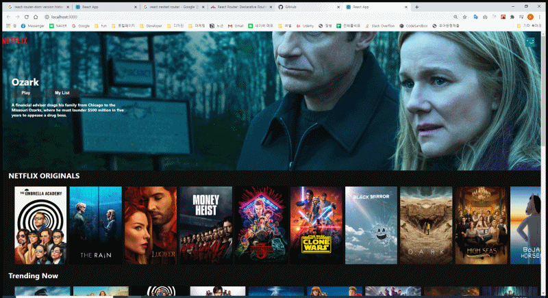

## [Netflix-clone] - Clever Programmer

-   firebase + react
-   200726_netflix > netflix-clone
-   https://netflix-clone-4f1a5.web.app/

.

// API. TMDB
// API. Firebase Hosting

// axios. 기본 url 설정
// axios. axios.create({ baseURL: '' })

// 팁. api. 모든 requests를 다 모아놓고 변수로 사용하면 깔끔
// 팁. api. request.js 파일

// visual studio. prettier. extenstion 세팅에서 format 검색
// visual studio. prettier. save할때마다 적용

// CSS. object-fit: contain => 사이즈 내에서 최대한 채움
// CSS. 페이지 옆으로 넘기기 => overflow-x:hidden
// CSS. 스크롤바 숨기기 => webkit-scrollbar (모든브라우저)

// 팁. 컴포넌트 분리. true, false 처럼 간단한 props 값으로 표현하면 깔끔
// 팁. 컴포넌트 분리. Row.js 컴포넌트에서 isLargeRow props 값을 이용
// 팁. 컴포넌트 분리. 다른건 다 같고 이미지 사이즈만 다르므로 true false로 분리

// 팁. CSS. 큰 배경의 경우는 그냥 부모 div에 backgroundImage로 줬음
// 팁. CSS. Banner.js > <Header> > backgroundImage
// 팁. CSS. Button:hover. 애니매이션 효과주면 더 좋음
// 팁. CSS. Button:hover. transition: all 0.2s;
// 팁. CSS. 그라데이션. 그라데이션 줄 위치에 div 생성
// 팁. CSS. 그라데이션. 높이를 주고 배경색으로 linear-gradient 이용
// 팁. CSS. 그라데이션. 각도랑 색상 지정해줄 수 있다.

// Math.floor(): 소숫점 이하 올림
// Math.random(): 0부터 1 사이의 랜덤한 값 얻을 수 있음

// 스크롤 nav. 스크롤 내리면 배경색 변경(투명 -> 검정)
// 스크롤 nav. useEffect. 마운트시 이벤트 추가/ 언마운트시 이벤트제거
// 스크롤 nav. useState 이용해서 100 밑으로 내려간경우 show=true
// 스크롤 nav. show값 이용하여 class 추가
// 스크롤 nav. 추가된 class에는 배경색 줄 것

// npm i movie-trailer
// react-youtube. npm i react-youtube
// react-youtube. 비디오 Id 있으면 유튜브 창을 만들 수 있음
// movie-trailer. 이름으로 영화 트래일러 url 검색해준다.
// movie-trailer. url로 유튜브 재생 할 수 있음
